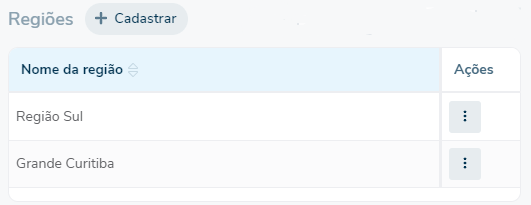

# Fretefy | Back .NET

Bem vindo,

Se você chegou até aqui é porque queremos conhecer um pouco mais sobre as suas habilidades no desenvolvimento back-end, para isso preparamos um projeto onde você terá que desenvolver um CRUD básico.

Caso você tenha alguma dúvida, pode esclarece-las por email, responderei o mais breve possível: christian.saddock@fretefy.com.br

Esperamos que você faça tudo o que o projeto especifica, mas se você não conhecer alguma tecnologia mesmo que seja o front ou back inteiro, ainda faça aquilo que você domina.

Boa sorte!

# Como começar?

1. Faça o fork do projeto `https://github.com/christiansaddock/Fretefy_BackDotNet`
2. Faça sua implementação
3. Suba seu código no fork criado
4. Nos avise sobre a finalização da implementação, preferencialmente por email: christian.saddock@fretefy.com.br 🚀

# Atividade

Implementar um cadastro básico de regiões, basicamente um formulário composto por um nome e as cidade/uf que compoem aquela região.
Implementar uma forma de exportar a listagem do cadastro de regiões, preferencialmente em excel.

### Campos Requeridos
- Nome
- Cidades
    - Cidade
    - UF

### Validações
- O campo nome é obrigatório
- Não deve permitir cadastrar duas regiões com o mesmo nome
- É obrigatório informar ao menos uma cidade na região
- Não pode ser informada a mesma cidade duas ou mais vezes
- Uma região pode ser desativada/ativada

> Imagem de referência para a listagem

# 2. Atividades Back-End

O back-end deve ser desenvolvido em ASP.Net Core 3.1 com uma WebApi REST e uma estruturação do projeto no formato do DDD. A persistência dos dados deve ser atraves do Entity Framework Core, no modelo Code First e utilizando Migrations.

Na pasta back-end já tem uma estrutura básica do projeto para começar, ele já está prepado para seguir os conceito de DDD, incluindo um exemplo.

Como utilizamos Entity para este projeto vamos utitilizar o SQLite para facilitar.

## Requisitos
- Implementar uma entidade região que contenha o nome e as cidades que compoem a região.
- A entidade Região deverão ser persistida em duas tabelas Regiao e RegiaoCidade em uma relação `1..N`.
- Implementar um RegiaoController que contenhas as operações de acordo com o verbo HTTP correspondente (`GET, POST, PUT`) que deverão chamar as respectivas ações do RegiaoService.
- Implementar um RegiaoService que contenha as operações do CRUD (`List, Create, Update`) que deverão chamar as respectivas ações do RegiaoRepository
- Implementar um Repository que contenham as operações de do CRUD (`List, Create, Update`) que deverão chamar as respectivas ações no Entity Framework
- Service e Repository deverão ser instanciados via Dependecy Injection no lifetime apropriado 
- Service e Repository deverão ter cada uma sua respectiva interface para uso e registro no Dependency Injection
- Poder exportar os dados através de um endpoint específico
- 
## Observações
1. Priorizamos o formato DDD na avaliação.
2. Fique a vontade para incluir mais operações que julgar necessário, mesmo que elas não estejam nos requisitos.
3. Para simplificar abstraimos o AppService do DDD, caso queira implementar, será um diferencial.
4. Quer fazer algo a mais? Seria um diferencial implementar por exemplo uma busca dos dados de Latitude e Longitude da cidade cadastrada pelas APIs do google ou do mapbox, buscando a chave para esse consumo do appsettings #FicaDica 😉

## Dicas
1. O CORS necessita ser configurado no back para que se comunique corretamente com o front, caso o faça 😉
2. Acha que pode melhorar alguma coisa que está implementada, vá em frente 😎
3. Tem algum conhecimento extra que gostaria de demonstrar, a hora é agora 🏆
